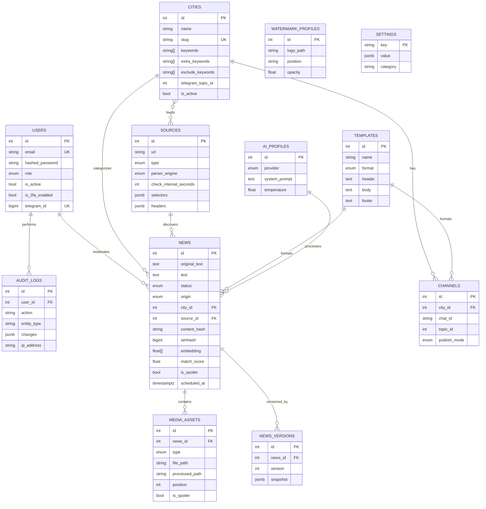

# Database schema & ER diagram



## Migrations

Managed by Alembic. The baseline is `alembic/versions/0001_initial.py`.

```bash
alembic upgrade head          # apply
alembic revision --autogenerate -m "message"   # create new
alembic downgrade -1          # roll back one
```
